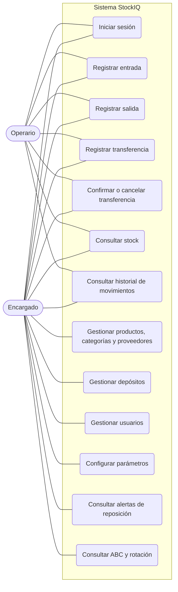
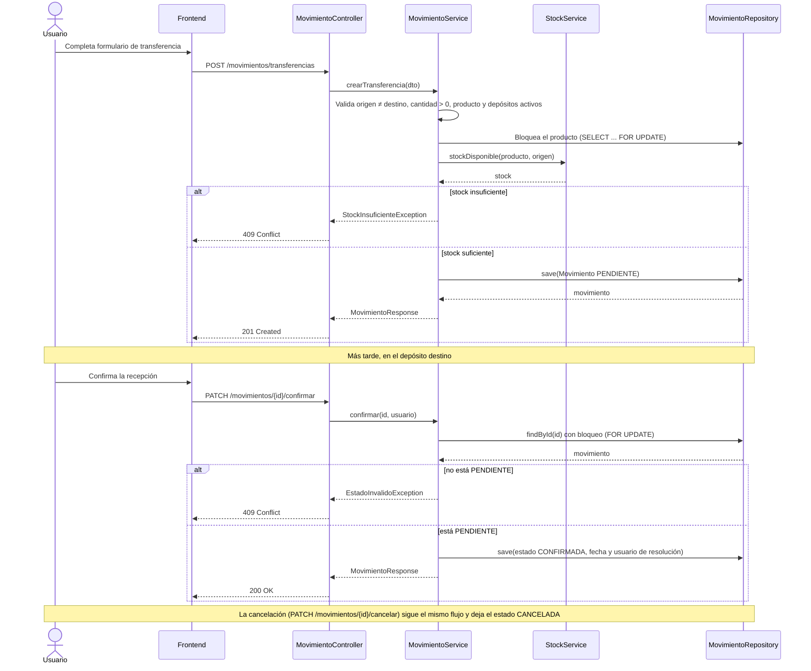
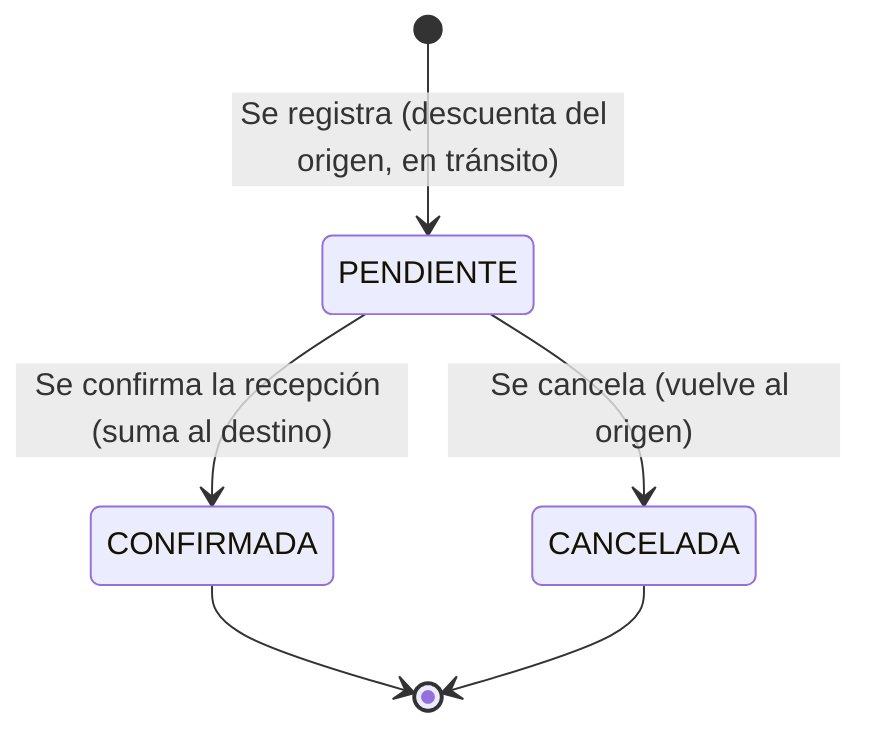
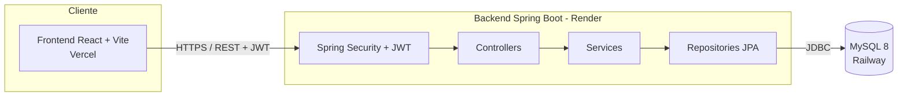
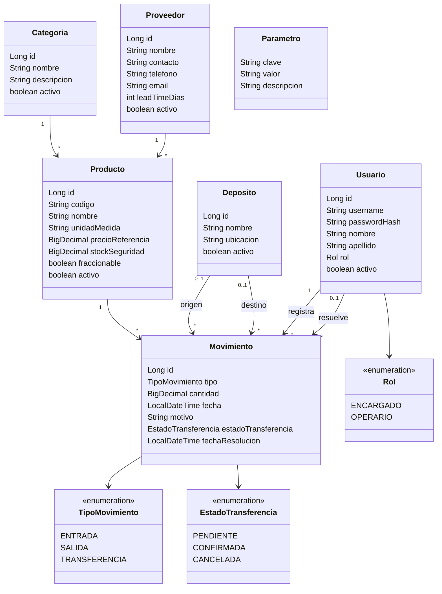

# StockIQ — Diagramas

Todos los diagramas están en Mermaid, que GitHub renderiza directamente en los archivos `.md`.

## 1. Diagrama Entidad-Relación

```mermaid
erDiagram
    CATEGORIA ||--o{ PRODUCTO : "clasifica"
    PROVEEDOR ||--o{ PRODUCTO : "abastece"
    PRODUCTO  ||--o{ MOVIMIENTO : "es movido en"
    USUARIO   ||--o{ MOVIMIENTO : "registra"
    USUARIO   |o--o{ MOVIMIENTO : "resuelve transferencia"
    DEPOSITO  |o--o{ MOVIMIENTO : "origen"
    DEPOSITO  |o--o{ MOVIMIENTO : "destino"

    CATEGORIA {
        bigint id PK
        varchar nombre UK
        varchar descripcion
        boolean activo
    }
    PROVEEDOR {
        bigint id PK
        varchar nombre UK
        varchar contacto
        varchar telefono
        varchar email
        int lead_time_dias
        boolean activo
    }
    PRODUCTO {
        bigint id PK
        varchar codigo UK
        varchar nombre
        bigint categoria_id FK
        bigint proveedor_id FK
        varchar unidad_medida
        decimal precio_referencia
        decimal stock_seguridad
        boolean fraccionable
        boolean activo
    }
    DEPOSITO {
        bigint id PK
        varchar nombre UK
        varchar ubicacion
        boolean activo
    }
    USUARIO {
        bigint id PK
        varchar username UK
        varchar password_hash
        varchar nombre
        varchar apellido
        enum rol
        boolean activo
    }
    MOVIMIENTO {
        bigint id PK
        enum tipo
        bigint producto_id FK
        decimal cantidad
        datetime fecha
        varchar motivo
        bigint usuario_id FK
        bigint deposito_origen_id FK
        bigint deposito_destino_id FK
        enum estado_transferencia
        datetime fecha_resolucion
        bigint usuario_resolucion_id FK
    }
    PARAMETRO {
        varchar clave PK
        varchar valor
        varchar descripcion
    }
```

## 2. Casos de uso

## 3. Secuencia: transferencia entre depósitos

## 4. Estados de una transferencia

## 5. Arquitectura

## 6. Diagrama de clases (dominio)

